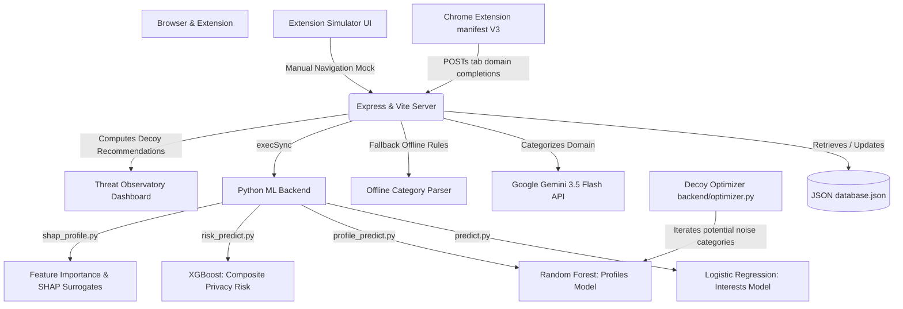

# PrivacyLens: Project Presentation Deck

This presentation deck explains the architecture, machine learning models, data flow, and features of the PrivacyLens project. You can present this as a slide deck or copy the content into a PPT presentation.

---

## Slide 1: Title & Vision
### **PrivacyLens: AI Tracking Observatory & Anti-Profiling Sandbox**
* **Subtitle**: Exposing and diluting corporate tracking algorithms in real time
* **Objective**: A dual-system tool (web dashboard + Chrome extension) that shows users how advertiser ML models profile them from browsing history, calculates real-time privacy risk, and generates custom decoy noise to obfuscate their digital footprint.
* **Key Focus**:
  * Real-time surveillance tracking visibility
  * Explainable AI (surrogate SHAP feature analysis)
  * Dynamic counterfactual threat modeling (domain-by-domain risk impact)
  * Intelligent, targeted information dilution (decoy generator)

---

## Slide 2: The Threat: Surveillance Capitalism & Advertiser Profiling
### **Why PrivacyLens Matters**
* **The Invisible Footprint**: Every website you visit leaks telemetry. Third-party ad trackers aggregate these sites into a unified textual history.
* **Algorithmic Profiling**:
  * Machine learning classifiers convert raw browsing logs into interest weights (e.g. *Gaming*, *Finance*, *AI/ML*).
  * Consumer profile models categorize you into target segments (e.g. *CryptoEnthusiast*, *Developer*, *LifestyleBuyer*) to serve targeted ads.
* **The Privacy Paradox**: Standard ad-blockers hide ads, but background trackers still capture metadata. PrivacyLens fights back not by blocking, but by **polluting** the tracking logs with strategic noise (decoys).

---

## Slide 3: Architecture & System Design


---

## Slide 4: Machine Learning Engine Deep-Dive
### **How PrivacyLens Classifies and Profiles Your Footprint**

* **Interest Classification (`predict.py`)**:
  * **Model**: TF-IDF Vectorizer + Logistic Regression.
  * **Task**: Maps tokenized browsing history to categories (e.g., `github` $\rightarrow$ *Programming*, `coinbase` $\rightarrow$ *Finance*).
* **Advertiser Segment Profiling (`profile_predict.py`)**:
  * **Model**: TF-IDF Vectorizer + Random Forest Classifier.
  * **Task**: Classifies the overall history into high-value consumer groups (e.g., *Developer*, *Gamer*, *CryptoEnthusiast*).
* **Composite Privacy Risk Score (`risk_predict.py`)**:
  * **Model**: XGBoost Regressor.
  * **Inputs**:
    1. **Confidence** (Advertiser categorization certainty)
    2. **Uniqueness** (Ratio of niche tech/AI sites to mainstream general sites)
    3. **Tracker Exposure** (Expected tracking density based on category mix)
  * **Output**: A calibrated risk score (0-99%) and threat levels (Low, Medium, High).

---

## Slide 5: Explainable AI & Counterfactual Impact
### **Opening the Black Box of Surveillance**

* **Surrogate SHAP Feature Importance (`shap_profile.py`)**:
  * Uses the Random Forest feature importances to show the user exactly which terms in their history (e.g., "leetcode", "bitcoin") are driving their profile classification.
* **Counterfactual Reasoning (`/api/counterfactual`)**:
  * Answers: *"What happens if I delete this single domain from my history?"*
  * The server runs a dry-run prediction excluding the target domain, showing the immediate drop in advertiser confidence.
* **Domain Risk Impact (`/api/domain-impact`)**:
  * Iterates over all history entries to rank visited websites by how much they contribute to your privacy risk, helping users identify their most "leaky" browsing activities.

---

## Slide 6: Strategic Obfuscation: The Anti-Profiling Engine
### **Fighting Tracking via Information Dilution**

* **The Concept**: Noise Injection. If you can't stop trackers from seeing your visits, make your tracking profile useless by visiting sites that contradict your primary profile.
* **Noise Optimization Algorithm (`backend/optimizer.py`)**:
  1. Identifies the user's highest-confidence profile (e.g. *Developer* @ 90% confidence).
  2. Iterates through potential decoy categories (Gardening, Cooking, Photography, Fitness).
  3. Appends terms from each category and simulates the profiles.
  4. Identifies the category that causes the **maximum drop** in the top profile's confidence.
* **Generative Decoys**:
  * Queries Gemini API or fallback rules to suggest high-impact domain names and search queries. Clicking them generates authentic decoy traffic, diluting your profile.

---

## Slide 7: Real-Time Capture: The Chrome Extension
### **Bridging the Sandbox with Real-World Browsing**

* **Background Service Worker (`extension/background.js`)**:
  * Listens to Chrome’s `chrome.tabs.onUpdated` API.
  * Triggers when tab updates complete.
  * Filters out system pages (`chrome://`, `about:`), local addresses, and empty tabs.
* **Telemetry Forwarding**:
  * Extracts the hostname (e.g., `github.com`).
  * Sends a background `POST` request to `http://localhost:3000/api/history`.
* **Zero Overhead**:
  * Fully asynchronous network requests run in the background worker without blocking browser rendering or performance.

---

## Slide 8: Technical Stack & Local Deployment
### **The Development Stack**

* **Frontend**: React (v19), TypeScript, Tailwind CSS, Lucide icons, Recharts (visualizations).
* **App Server / API**: Node.js, Express, Vite development middleware, `tsx` runner.
* **Database**: Lightweight local JSON file (`database.json`) acting as a document store.
* **ML Service**: Python 3.x, `scikit-learn` (classifier models), `joblib` (unpickling), `xgboost` (risk prediction regressor).

#### **Running in 3 Steps:**
1. **Install dependencies**:
   ```bash
   npm install
   pip3 install joblib scikit-learn xgboost
   ```
2. **Configure environment**: Create a `.env` file with your `GEMINI_API_KEY`.
3. **Boot the project**:
   ```bash
   npm run dev
   ```
   *Open `http://localhost:3000` to view the Threat Observatory dashboard.*
